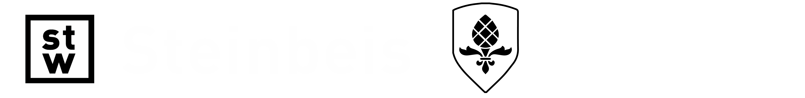

    

This repository contains the code and slides for the Steinbeis Coding Bootcamp. This code is supposed to be used in combination to the online lectures.

| Unit | Class Name                       | Slides     | Notebook     |
| ---- | -------------------------------- | ---------- | ------------ |
| 00   | Introduction to Python           | [Slides]() | [Notebook]() |
| 01   | NumPy                            | [Slides]() | [Notebook]() |
| 02   | Pandas                           | [Slides]() | [Notebook]() |
| 03   | SQL                              | [Slides]() | [Notebook]() |
| 04   | Git                              | [Slides]() | [Notebook]() |
| 06   | Coding Best Practices (1/2)      | [Slides]() | [Notebook]() |
| 07   | Coding Best Practices (2/2)      | [Slides]() | [Notebook]() |
| 08   | Robotic Process Automation (1/2) | [Slides]() | [Notebook]() |
| 09   | Robotic Process Automation (2/2) | [Slides]() | [Notebook]() |
| 10   | Test Driven Development          | [Slides]() | [Notebook]() |

